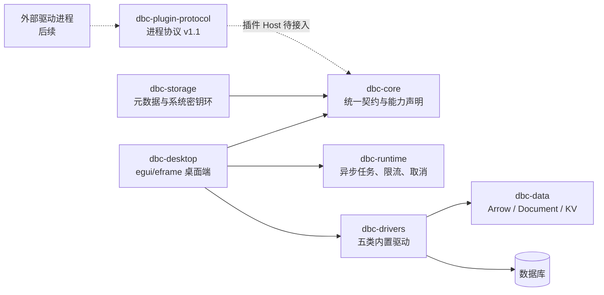

# DBC

DBC 是一个使用 Rust、egui/eframe 和原生数据库驱动实现的桌面数据库客户端。界面布局参考
[DBX](https://github.com/t8y2/dbx)：左侧管理连接与数据库对象，中间提供查询编辑器、结果集、
执行计划和慢查询，右侧展示当前驱动能力。

> 当前状态：早期可运行版本。五类主流数据库内置驱动和核心操作已经实现；进程插件协议已经定义，
> 但插件发现、安装和进程托管仍属于后续工作。

## 已实现

- PostgreSQL、MySQL / MariaDB、SQLite、MongoDB、Redis / Valkey 的原生驱动工厂。
- 统一的 CRUD 查询入口：
  - SQL 数据库使用 SQL。
  - MongoDB 使用类型化 JSON 操作信封。
  - Redis / Valkey 使用原生命令。
- 懒加载数据库对象树。
- 流式查询契约、Arrow 列式批次、文档批次和键值批次。
- 增量结果表和本地分页；每页默认 200 行，单次交互查询默认最多保留 10,000 行、
  64 MiB，查询失败或取消时保留已接收结果。
- 当前缓冲结果与完整重跑查询的 CSV / JSONL 导出。
- Estimated / Analyze 执行计划；具体能力由驱动声明。
- 数据库原生慢查询统计。
- 30 秒操作超时、协作式取消和受限并发运行时。
- SQL、MongoDB 和 Redis / Valkey 写操作二次点击确认。
- 有界、可版本协商的进程插件协议 v1.1。

各数据库的能力差异、前置配置和已验证版本见
[数据库支持矩阵](docs/database-support.md)。

## 界面

```text
┌──────────────────────────── 顶部工具栏 ────────────────────────────┐
│ 数据库类型/连接 │ 查询编辑器 + 数据/计划/慢查询 │ 驱动能力与上下文 │
│ 可收起对象树    │ 可调整编辑器/结果区 + 状态栏  │ 可收起能力面板   │
└───────────────────────────────────────────────────────────────────┘
```

egui/eframe 通过 WGPU 提供跨平台原生渲染。左右面板和编辑器/结果区都可以调整尺寸，
查询编辑器支持 SQL、JSON、Shell 高亮及行号，结果表仅渲染可见行并支持调整列宽和拖动列顺序。
复杂的 SQL 执行计划图暂时使用可滚动 JSON/文本展示。

## 架构



工作区包含：

| crate | 职责 |
| --- | --- |
| `dbc-core` | 驱动 trait、查询/对象树/计划/慢查询契约、能力和安全策略 |
| `dbc-data` | Arrow、文档、键值结果批次及有界结果缓冲 |
| `dbc-runtime` | 独立 Tokio 运行时、全局并发限制和取消 |
| `dbc-storage` | 非敏感连接元数据和操作系统密钥环基础设施 |
| `dbc-plugin-protocol` | Protobuf 控制消息及有界帧编解码 |
| `dbc-drivers` | 内置原生数据库驱动 |
| `dbc-desktop` | egui/eframe 桌面应用 |

详细设计与取舍见
[ADR-0001：模块化数据库驱动架构](docs/adr/0001-modular-driver-architecture.md)。

## 性能边界

- 驱动通过 `QueryEvent` 发送批次，避免逐单元格跨层调用。
- 关系型结果使用 Arrow `RecordBatch`；MongoDB 保留其自然文档模型；Redis / Valkey
  响应转换为有界、二进制安全的 JSON 文档。
- 对象树按需加载，结果表只渲染可见区域。
- 驱动任务不运行在 egui UI 线程。
- 查询批次通过有界通道增量送入 UI，并通过 `request_repaint` 唤醒事件循环；界面只投影
  当前页，原始批次保留在有界缓冲区中。
- 查询受超时、取消、行数、内存和协议帧大小限制。

交互查询提供固定预设：每页 100 / 200 / 500 / 1,000 行，缓冲行上限
10k / 50k / 100k，内存上限 64 / 128 / 256 MiB。页大小立即作用于当前结果；
行数和内存上限从下一次执行开始生效。单元格显示最多 32 KiB，导出仍使用未截断的原始值。

“导出当前”会导出缓冲区中的全部行，而不只是当前页；“完整导出”会以独立任务重新执行最近
一次查询。两者均先写同目录临时文件，成功后再原子替换目标。完整导出最长运行 24 小时，
硬限制为 1,000,000 行或 2 GiB；超限、取消或失败不会覆盖目标文件。完整导出重新执行写操作
时需要独立二次确认，MongoDB `aggregate` 中包含 `$out` 或 `$merge` 也按写操作处理。

CSV 中关系型结果保留原列名，文档写入单个 `document` JSON 列，键值数据使用 Base64；
JSONL 中关系型结果先写 schema、随后逐行写 `values` 数组，文档保持原始嵌套 JSON，键值数据
同样使用 Base64。两种格式都不会扁平化嵌套数据。

## 构建与运行

要求：

- Rust `1.97.1`（由 `rust-toolchain.toml` 固定）。
- Linux、macOS 或 Windows。Linux 需要 Vulkan 驱动，Windows 使用 DX12，macOS 使用 Metal。
- Linux 构建需要 X11/Wayland、CJK 字体和 C/C++ 编译依赖。Ubuntu 可安装：

```bash
sudo apt-get update
sudo apt-get install -y \
  build-essential pkg-config \
  fonts-noto-cjk \
  libfontconfig1-dev libfreetype6-dev \
  libwayland-dev libx11-dev libxcb1-dev libx11-xcb-dev \
  libxkbcommon-dev \
  libvulkan1 mesa-vulkan-drivers
```

启动桌面端：

```bash
cargo run -p dbc-desktop
```

SQLite 可以直接使用内存数据库。其他数据库需要先启动对应服务，再在左侧填写
连接地址、数据库、用户和密码。

开发检查：

```bash
cargo clippy --locked --workspace --all-targets --all-features -- -D warnings
cargo test --locked --workspace
```

真实数据库契约测试默认标记为 `ignored`，测试文件顶部记录了各自需要的连接环境变量。

修改插件协议后，只生成目标 proto，避免影响其他生成文件：

```bash
buf generate --path proto/driver/v1/driver.proto
```

## 查询示例

SQL：

```sql
SELECT current_database(), current_user, version();
```

MongoDB：

```json
{
  "operation": "find",
  "collection": "items",
  "filter": {},
  "limit": 100
}
```

MongoDB 支持 `find`、`aggregate`、`insertOne`、`updateOne`、`updateMany`、`deleteOne`、
`deleteMany` 和 `runCommand`。

Redis / Valkey：

```text
SET greeting "hello world"
GET greeting
SCAN 0 COUNT 100
```

连接地址支持 `redis://`、`rediss://`、`valkey://` 和 `valkeys://`。对象树使用渐进式
`SCAN`，会拒绝可能阻塞服务端的 `KEYS` 命令。

## 安全说明

- 桌面端首版不会持久化连接密码，密码只在内存中传递，并由 `SecretValue` 在释放时清零。
- `dbc-storage` 已提供系统密钥环抽象，但尚未接入当前连接表单。
- 写操作确认只是误操作保护，不是 SQL 沙箱。应使用最小权限数据库账号。
- `EXPLAIN ANALYZE` 会真实执行查询；对写语句使用前必须确认其影响。
- 慢查询和系统目录通常需要额外数据库权限，客户端不会尝试提升权限。

## 后续方向

1. 接入进程插件 Host：发现、签名/信任策略、生命周期、崩溃隔离和 SDK。
2. 保存连接配置，并把凭据接入操作系统密钥环。
3. 数据导入和数据编辑器。
4. 可视化执行计划、会话/锁监控和数据库专用诊断面板。
5. 按支持矩阵路线扩展 SQL Server、Oracle、CockroachDB、TiDB、OceanBase、
   Cassandra / ScyllaDB、Elasticsearch / OpenSearch、Neo4j 等数据库。
