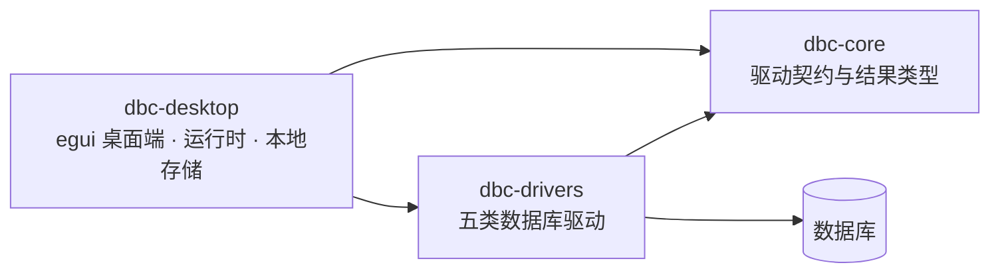

# DBC

用 Rust 写的桌面数据库客户端：一个可执行文件，装上就能连 PostgreSQL、MySQL / MariaDB、
SQLite、MongoDB 和 Redis / Valkey。不需要预装数据库客户端库，不需要 GPU 驱动，
不需要系统密钥环服务。

> 当前状态：可日常使用的早期版本。五类数据库的连接、查询、对象浏览、表数据安全编辑、
> 执行计划、慢查询和导出都已可用，并有针对真实数据库的契约测试。

## 快速开始

### 构建

需要 Rust `1.97.1`（由 `rust-toolchain.toml` 固定）。Linux 上还需要 C 编译工具链，
用于把 SQLite 引擎静态编译进二进制：

```bash
sudo apt-get install -y build-essential pkg-config
```

这就是全部。界面通过 glow（OpenGL）渲染，不要求 Vulkan 驱动；字体、文件选择和凭据
存储都在应用内实现，不依赖 fontconfig、桌面门户或密钥环服务。release 二进制在 Linux
上只动态链接 `libc`、`libm` 和 `libgcc_s`：

```console
$ ldd target/release/dbc-desktop
	linux-vdso.so.1
	libgcc_s.so.1 => /lib/x86_64-linux-gnu/libgcc_s.so.1
	libm.so.6 => /lib/x86_64-linux-gnu/libm.so.6
	libc.so.6 => /lib/x86_64-linux-gnu/libc.so.6
	/lib64/ld-linux-x86-64.so.2
```

### 运行

```bash
cargo run -p dbc-desktop
```

不用连数据库也能先跑起来：左侧驱动选 **SQLite**，连接地址保持 `sqlite::memory:`，
点「连接」即可开始写 SQL。

### 第一次连接

1. 左侧选择驱动，填连接地址、数据库、用户名、密码
2. 点「测试」验证参数（只建立一次连接，不影响当前会话）
3. 点「连接」，对象树开始按需加载
4. 填一个连接名称后点「保存」，下次直接从「已保存连接」里选

## 核心操作

### 快捷键

| 快捷键 | 动作 |
| --- | --- |
| `Ctrl`/`Cmd` + `K` | 命令面板 |
| `Ctrl`/`Cmd` + `Enter` | 执行查询 |
| `Esc` | 取消正在执行的操作 |
| `F5` | 刷新对象树 |
| `Ctrl`/`Cmd` + `S` | 生成表数据变更的 SQL 预览并提交 |
| `Ctrl`/`Cmd` + `T` | 新建查询标签页 |
| `Ctrl`/`Cmd` + `W` | 关闭当前标签页 |
| `Ctrl` + `Tab` | 切换到下一个标签页 |

### 命令面板

`Ctrl+K` 打开，输入即筛选。执行查询、切换标签页、打开某张表、载入已保存连接、
回填历史查询、导出、解锁凭据库都在这里，按子序列匹配（输入 `sql` 能命中「SQL 编辑器」）。
这样工具栏只需要保留少数几个真正高频的按钮。

### 多标签工作区

每个标签页有自己的查询文本、结果、分页和操作，互不干扰：一个标签页在跑长查询时，
另一个照样可以查数据。标签页上的 ● 表示它正在执行。

双击对象树里的表会**新开一个标签页**，不会覆盖正在写的查询；同一张表再次打开会切回
已有标签页而不是重复开。异步结果按标签页 id 投递，切换标签页不会把结果送错地方。

### 连接管理

连接配置存在配置目录下的 `settings.json`（Linux 为 `~/.config/dbc/`，
macOS 为 `~/Library/Application Support/dbc/`，Windows 为 `%APPDATA%\dbc\`）。
这个文件是人可读的纯 JSON，可以直接备份、diff 或手改，**里面不含任何密码**。

密码要保存时走独立的加密凭据库 `secrets.bin`：主密码经 Argon2id 派生密钥，
内容用 ChaCha20-Poly1305 加密，Unix 下文件权限 `0600`。点侧栏的锁图标设置主密码或解锁。
凭据库不依赖操作系统密钥环，因此在 SSH、容器和无桌面环境里行为一致。

### 对象树

- 按需加载，展开一层才查一层
- 超过每页 500 条的分支会显示「加载更多」，不会静默截断
- 关系型数据库双击表或视图进入数据浏览
- `F5` 或标题栏的 ⟳ 重新加载（建表之后能立刻看到）

### 查询与结果

查询编辑器按驱动切换语法高亮并显示行号，并根据对象树已加载的表名、列名和 SQL 关键字
提供补全（`Tab` 接受，`Esc` 关闭）；补全只用已经取到的元数据，不会额外发查询。
工具栏的「历史」保留最近执行过的查询，按驱动过滤，点击回填到编辑器。

结果表只渲染可见行，列宽可拖、列序可拖动调整。右键单元格可以复制单元格、整行、整列，
或把当前页复制为 CSV / JSON。单元格显示上限 32 KiB，导出使用未截断的原始值。

交互查询有固定预设：每页 100 / 200 / 500 / 1,000 行，缓冲行上限 10k / 50k / 100k，
内存上限 64 / 128 / 256 MiB。页大小立即生效；行数和内存上限从下次执行开始生效。
查询失败或取消时已接收的行会保留。

**取消**：PostgreSQL 与 MySQL 会向服务端发出原生取消（`pg_cancel_backend` /
`KILL QUERY`），语句在数据库侧真正停止；SQLite、MongoDB 和 Redis 只能停止客户端
接收，能力矩阵里如实标注了这个差别。

### 表数据编辑

双击对象树里的表或视图进入服务端分页浏览，每页执行精确 `COUNT`。支持结构化筛选、
原始 `WHERE` / `ORDER BY` 片段和稳定排序。

编辑暂存在客户端，保留 `NULL`、文本和二进制值的差异。提交分两步：先生成参数化 SQL
预览（语句顺序和绑定参数就是实际提交内容），确认后在单个事务里原子提交。

只有存在非空主键或全部列非空的唯一键的普通表才可编辑；视图始终只读。简单单表
`SELECT` 的结果也可编辑，JOIN、CTE、聚合、集合操作等明确降级为只读并显示原因。
详见 [ADR-0002](docs/adr/0002-safe-relational-table-editing.md)。

### 导出

支持 CSV、JSONL 和 Markdown 三种格式，两个范围：

- **导出当前**：写出缓冲区中的全部行，不只是当前页
- **完整导出**：以独立任务重新执行最近一次查询，上限 1,000,000 行 / 2 GiB

文件选择器是应用内绘制的，不依赖桌面门户服务。所有写入都先落到同目录临时文件，
成功后原子替换目标；超限、取消或失败都不会覆盖已有文件。

## 支持的数据库

| 数据库 | 查询方式 | 对象树 | 表数据编辑 | 执行计划 | 慢查询 | 原生取消 |
| --- | --- | --- | --- | --- | --- | --- |
| PostgreSQL | SQL | ✅ | ✅ | ✅ | ⚙️ `pg_stat_statements` | ✅ |
| MySQL / MariaDB | SQL | ✅ | ✅ | ✅ | ⚙️ `performance_schema` | ✅ |
| SQLite | SQL | ✅ | ✅ | 仅 Estimated | — | — |
| MongoDB | 类 shell 语法 | ✅ | — | ✅ | ⚙️ profiler | — |
| Redis / Valkey | Redis 命令 | ✅ `SCAN` | — | — | ⚙️ `SLOWLOG` | — |

⚙️ 表示需要服务端配置或额外权限。各库的详细差异、已验证版本和扩展路线见
[数据库支持矩阵](docs/database-support.md)。

查询示例：

```sql
SELECT current_database(), current_user, version();
```

```javascript
db.items.find({ "active": true }).sort({ "id": 1 }).limit(100)
```

```text
SET greeting "hello world"
SCAN 0 COUNT 100
```

MongoDB 接受 `db.<集合>.<方法>(...)` 的 shell 写法，支持链式 `.limit()`、`.skip()`、
`.sort()`，方法覆盖 `find`、`aggregate`、`insertOne`、`updateOne`、`updateMany`、
`deleteOne`、`deleteMany` 和 `db.runCommand()`。括号里的参数必须是**合法 JSON**
（键要加引号）——shell 的宽松 JSON 不被接受，解析器会直接指出来而不是猜。
早先的 `{"operation": "find", ...}` JSON 信封仍然可用。

Redis 连接地址支持 `redis://`、
`rediss://`、`valkey://` 和 `valkeys://`；对象树使用渐进式 `SCAN`，会拒绝可能阻塞
服务端的 `KEYS`。

## 安全说明

- `settings.json` 不含密码；密码只在加密的 `secrets.bin` 里，或者只存在于内存中
- 密码在内存里由 `SecretValue` 持有，释放时清零；错误信息不回显凭据
- 写操作需要二次点击确认。这是误操作保护，不是 SQL 沙箱——请使用最小权限账号
- 表数据编辑只在存在稳定键时启用；更新和删除必须恰好影响一行，否则整批事务回滚
- 结构化筛选和所有数据变更值始终使用绑定参数，不拼接进 SQL
- 原始 `WHERE` / `ORDER BY` 片段会按当前方言解析并拒绝多语句，但仍由数据库执行，
  只应输入自己信任的表达式
- `EXPLAIN ANALYZE` 会真实执行查询，对写语句使用前必须确认其影响

## 架构



| crate | 职责 |
| --- | --- |
| `dbc-core` | 驱动 trait、能力声明、对象树/计划/慢查询契约、列式结果类型、表编辑安全模型 |
| `dbc-drivers` | 五类数据库驱动，方言差异收敛在 `relational.rs` |
| `dbc-desktop` | egui 界面、异步任务运行时、配置与凭据存储、导出 |

`dbc-desktop` 内部按职责分文件：`app/`（状态、事件投递、视图、命令）、`store/`
（配置与加密凭据）、以及 `palette` / `file_picker` / `fonts` / `shortcuts` /
`status` / `atomic_file` / `text_format` 等自包含模块。

设计取舍见 [ADR-0001：模块化数据库驱动架构](docs/adr/0001-modular-driver-architecture.md)、
[ADR-0002：关系表安全编辑](docs/adr/0002-safe-relational-table-editing.md)、
[ADR-0003：自研本地依赖与结果表示](docs/adr/0003-self-contained-local-dependencies.md) 和
[ADR-0004：多标签工作区](docs/adr/0004-tabbed-workspace.md)。

## 开发

```bash
cargo clippy --locked --workspace --all-targets --all-features -- -D warnings
cargo test --locked --workspace
```

针对真实数据库的契约测试标记为 `ignored`，需要设置环境变量后用 `--include-ignored`
运行。本地起一套依赖：

```bash
docker run -d --name dbc-pg -e POSTGRES_PASSWORD=dbcpass -e POSTGRES_DB=dbc_contract \
  -p 55432:5432 postgres:16 -c shared_preload_libraries=pg_stat_statements
docker run -d --name dbc-mysql -e MYSQL_ROOT_PASSWORD=dbcpass -e MYSQL_DATABASE=dbc_contract \
  -p 53306:3306 mysql:8.4
docker run -d --name dbc-redis -p 56379:6379 redis:7
docker run -d --name dbc-mongo -p 57017:27017 mongo:7

docker exec dbc-pg psql -U postgres -d dbc_contract \
  -c "CREATE EXTENSION IF NOT EXISTS pg_stat_statements;"
docker exec dbc-redis redis-cli CONFIG SET slowlog-log-slower-than 0
docker exec dbc-mongo mongosh --quiet dbc_contract --eval 'db.setProfilingLevel(2)'

DBC_TEST_POSTGRES_URL=postgres://127.0.0.1:55432/dbc_contract \
DBC_TEST_POSTGRES_USER=postgres DBC_TEST_POSTGRES_PASSWORD=dbcpass \
DBC_TEST_MYSQL_URL=mysql://127.0.0.1:53306/dbc_contract \
DBC_TEST_MYSQL_USER=root DBC_TEST_MYSQL_PASSWORD=dbcpass \
DBC_TEST_MYSQL_DATABASE=dbc_contract \
DBC_TEST_REDIS_URL=redis://127.0.0.1:56379 \
DBC_TEST_MONGODB_URL=mongodb://127.0.0.1:57017/dbc_contract \
  cargo test -p dbc-drivers -- --include-ignored
```

缺少环境变量时测试会打印 `skipped: <变量名> is not set` 而不是静默通过。
CI 用同一套配置运行这些测试。

## 后续方向

1. 多连接并存：目前整个窗口共用一个连接，切换驱动会重置工作区
2. 数据导入、批量粘贴和更丰富的单元格编辑器
3. 可视化执行计划、会话与锁监控
4. 按支持矩阵路线扩展更多数据库
