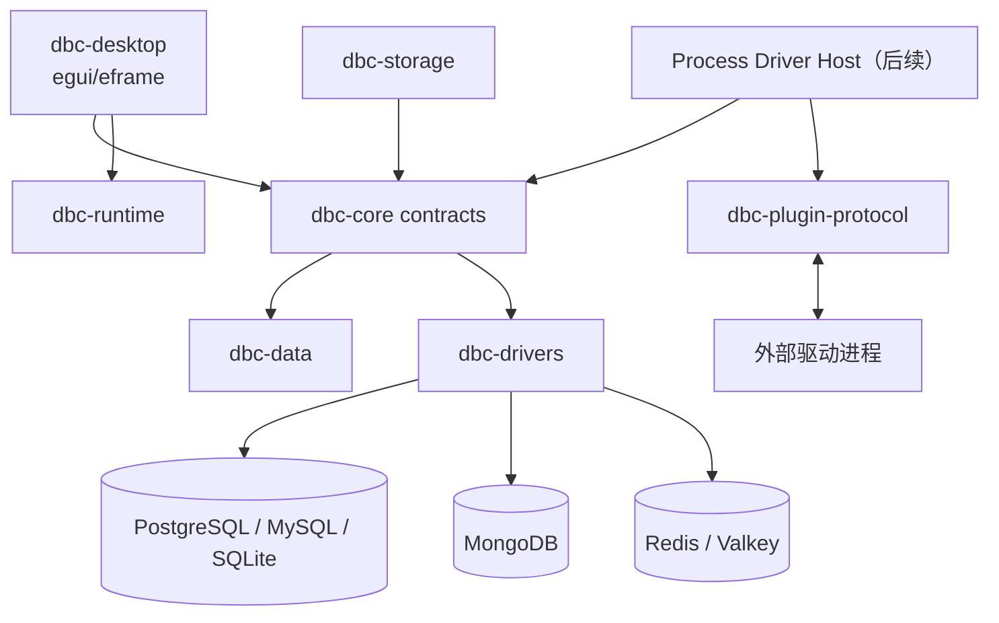

# ADR-0001：采用模块化数据库驱动架构

## 状态

Accepted

## 背景

DBC 需要在一个桌面客户端中支持主流关系型、文档型和键值数据库，同时满足：

- CRUD、对象发现、查询执行、取消、执行计划和慢查询等统一交互。
- 不掩盖不同数据库之间的能力和数据模型差异。
- 查询不能阻塞 egui UI 线程，结果集和协议消息必须有界。
- 内置常用数据库需要低延迟；第三方数据库需要可扩展且可隔离。
- 密码、错误和日志不能意外泄露凭据。
- 一个驱动故障不应迫使 UI 和所有其他驱动一起改变。

单一 SQL 抽象不能覆盖 MongoDB 操作或数据库专用诊断。把所有驱动直接写入
界面层又会形成难以测试和扩展的条件分支。

## 决策

### 1. 以稳定的核心 trait 隔离界面和驱动

`dbc-core` 定义 `DriverFactory`、`DatabaseSession` 和请求/响应契约。桌面端只依赖这些
契约和 `DriverDescriptor`，不直接依赖具体连接池类型。

每个驱动必须声明：

- 支持的查询语言。
- CRUD 是否事务化。
- Estimated / Analyze 执行计划能力。
- 慢查询能力及其是否可配置。
- 取消等附加能力。

不支持的能力返回结构化 `Unsupported` 错误，界面根据 descriptor 禁用入口。

### 2. 保留三类自然结果模型

`dbc-data` 使用：

- Arrow `RecordBatch` 表示关系型/列式结果。
- JSON 文档表示文档数据库结果。
- 二进制安全的 key/value 记录表示键值数据库结果。

所有模型都通过 `QueryEvent` 流传递。调用方还必须设置超时和行数上限，避免把完整远程
数据集加载进桌面进程。

### 3. 内置驱动原生运行，长尾驱动使用进程边界

首批高频数据库作为 `dbc-drivers` 内置驱动，以获得较低延迟、类型安全和简单分发。

长尾和第三方驱动采用独立进程协议：

- Protobuf 控制消息负责握手、连接、查询、对象树、执行计划、慢查询、取消和关闭。
- Arrow IPC、JSON 文档和 key/value frame 负责数据传输。
- 协议使用主/次版本协商；主版本不兼容时拒绝加载。
- header 和 payload 在分配前检查大小。

当前版本已经实现协议 v1.1 和 frame codec；插件发现、进程监管、签名/信任和 Host 到
`DatabaseSession` 的适配器在后续里程碑实现。在 Host 完成前，不把外部插件标记为可用功能。

### 4. 驱动任务与 egui UI 线程分离

`dbc-runtime` 持有独立 Tokio runtime 和全局 semaphore。每个任务获得
`CancellationToken`，取消、操作失败和 join 失败保持为不同错误。

驱动不能在 egui UI 线程上直接执行数据库操作。运行时通过完成事件和有界查询事件通道
把结果交给 eframe 的 `App::logic`，后台发送事件后调用 `request_repaint` 唤醒界面。
未来插件若使用同步数据库 API，必须进入阻塞工作线程。驱动应尽可能调用数据库原生取消机制。

### 5. 安全边界

- 连接 profile 只保存 `secret_id`，凭据由独立 `SecretValue` 传入并在释放时清零。
- 桌面首版密码只驻留内存；后续持久化必须使用 `dbc-storage` 的操作系统密钥环。
- 日志和 `Debug` 输出必须脱敏。
- SQL、MongoDB 和 Redis / Valkey 写操作由客户端风险分类并二次确认。
- 插件进程默认不视为可信；Host 需要显式信任策略、最小环境变量和生命周期限制。

## 高层结构

## 失败模式与应对

| 失败模式 | 应对 |
| --- | --- |
| 数据库或网络长时间无响应 | 每个请求强制 timeout，并支持取消 |
| 查询返回无限或超大结果 | 行数上限、批次传输、有界 frame；后续使用分页/导出 |
| 同步驱动阻塞 async worker | 专用阻塞线程和数据库原生 interrupt |
| 驱动声称数据库不具备的能力 | descriptor 精确声明，契约测试验证 |
| 慢查询系统表无权限/未启用 | 返回权限或不可用错误，不自动修改服务端配置 |
| 外部插件崩溃或发送畸形消息 | 进程隔离、协议大小限制；Host 后续加入重启/熔断 |
| 凭据进入日志或持久化明文 | 脱敏 `Debug`、内存清零、系统密钥环 |
| `EXPLAIN ANALYZE` 产生副作用 | UI 明确标识真实执行，并保留写操作确认 |

## 后果

### 正面

- UI、内置驱动和未来插件共享同一套可测试契约。
- Arrow 批次和原生数据模型兼顾性能与语义准确性。
- 新数据库可以独立声明能力，不需要在 UI 中增加数据库类型分支。
- 进程协议为不稳定依赖、许可证复杂驱动和第三方扩展提供隔离边界。
- 超时、取消、并发上限和结果上限成为跨驱动的一致要求。

### 负面

- 内置驱动仍会增加二进制体积和首次编译/链接时间，因此只保留五类主流数据库。
- 一个统一 trait 无法消除数据库方言差异，专用功能仍需扩展能力或专用面板。
- 原生驱动运行在同一进程，内存耗尽或底层库崩溃仍会影响桌面应用。
- 进程插件协议需要维护版本兼容、SDK、监管和安全模型。

### 中性

- 首版先使用 10,000 行有界收集模型；增量 UI 和导出作为独立优化演进。
- 数据库兼容协议只能降低接入成本，不能替代真实版本契约测试。

## 备选方案

### 所有数据库统一使用 SQL/ODBC

未采用。MongoDB 没有等价 SQL 语义，ODBC 还会弱化对象树、取消和诊断能力，
并引入平台驱动管理依赖。

### 所有驱动静态链接进桌面端

未作为长期方案。运行时性能最好，但二进制、构建时间、许可证和崩溃域会随数据库数量持续
扩大，也无法安全承载第三方驱动。

### 所有驱动都使用独立进程

未用于首批内置驱动。隔离更强，但会增加序列化、进程管理和桌面分发复杂度。对首批高频
数据库，原生 trait 实现的收益更高。

### 使用 Web UI / Electron / Tauri

当前未采用。egui/eframe 通过 WGPU 提供 Linux、macOS、Windows 原生 GPU 渲染和
Rust 内状态模型，适合虚拟表格及低延迟桌面交互。如果未来某个复杂可视化在 egui 中
成本过高，可以只在该面板使用 WebView，而不替换整个应用架构。

## 参考

- [数据库支持矩阵](../database-support.md)
- [插件协议](../../proto/driver/v1/driver.proto)
- [egui](https://github.com/emilk/egui)
- [DBX 参考项目](https://github.com/t8y2/dbx)
